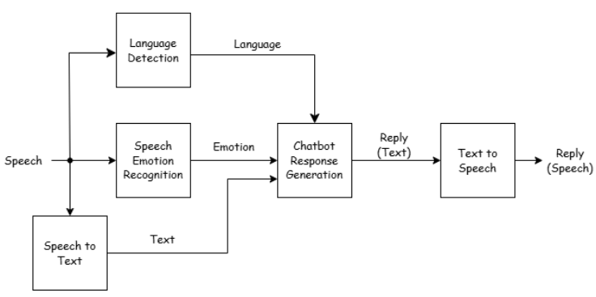

# EmoLingo: An Emotion-Aware Conversational Agent for Personalized Emotional Support

This repository demonstrates a **Speech Emotion Recognition (SER)** pipeline integrated into a conversational AI system. The system takes in a speech input, transcribes it to text, detects emotional cues in the speech signal, then uses GPT to generate an appropriate response based on both the context and the detected emotion, and finally converts the generated reply back into speech.

## Table of Contents
- [Overview](#overview)
- [Features](#features)
- [Model Architecture](#model-architecture)
- [Execution Flow](#execution-flow)
- [Model Details](#model-details)
  - [Speech Language Detection](#speech-language-detection)
  - [Speech to Text (STT)](#speech-to-text-stt)
  - [Speech Emotion Recognition (SER)](#speech-emotion-recognition-ser)
  - [GPT-based Response Generation](#gpt-based-response-generation)
  - [Text to Speech (TTS)](#text-to-speech-tts)
- [Contributors](#contributors)

---

## Overview

This project focuses on creating an end-to-end pipeline for an **emotion-aware conversational AI**. By leveraging **Speech Language Detection** model and **Speech to Text (STT)**, a **Speech Emotion Recognition (SER)** model, a **GPT-based** text generator, and a **Text to Speech (TTS)** module, the system is capable of:

1. Taking raw audio input from a user.
2. Transcribing the speech into text.
3. Analyzing audio-based emotional cues.
4. Generating an appropriate and empathetic response (via GPT) based on context and detected emotion.
5. Converting the generated text reply back into speech for the user to hear.

---

## Features

- **Language Detection**: Detects the input language to ensure the response is generated in the same language.
- **Real-time STT**: Automatically transcribes user speech to text in real-time.
- **Emotion Detection**: Identifies emotions such as happiness, sadness, anger, fear, etc.
- **GPT Response Generation**: Leverages a large language model to respond contextually and empathetically.
- **TTS Output**: Speaks out the generated text in a natural-sounding voice.

---

## Model Architecture
This repository implements a Speech Emotion Recognition (SER) pipeline with the following components:

 1. **Speech Language Detection**: Detects the language of the input audio to assist with language processing and GPT-based response generation.

 2. **Speech to Text (STT)**: Converts speech input into text.

 3. **Speech Emotion Recognition (SER)**: Detects emotions from speech input using a Convolutional Neural Network (CNN) model.

 4. **GPT-based Response Generation**: Uses the detected emotion and transcribed text as input to generate context-aware responses.

 5. **Text to Speech (TTS)**: Converts the generated text response into speech output.

---

## Execution Flow

The execution flow of the pipeline is depicted by the following diagram:

 ### 1. Input Processing:

  - Audio input is recorded or provided as a file.

  - The Speech Language Detection module processes the raw audio to determine its language. 

  - The Speech to Text (STT) module transcribes the speech into text.

### 2. Emotion Detection:

  - The SER model analyzes the audio features to predict the emotion.

 ### 3. Response Generation:

  - The detected emotion and transcribed text are fed into a GPT-based model to generate an appropriate response.

 ### 4. Output Processing:

  - The generated response is synthesized into speech output using the Text to Speech (TTS) module.

---

## Model Details 

### Speech Language Detection
  - **Model Used**: Pre-trained OpenAI's Whisper model.

  - **Purpose**: To determine how the STT model processes the input and ensures that GPT generates responses in the same language.

### Speech to Text (STT)
  - **Model Used**: Pre-trained Google Speech Recognition API.

  - **Purpose**: To transcribe spoken language into text for further processing.

### Speech Emotion Recognition (SER)
  - **Architecture:** Convolutional Neural Network (CNN)

  - **Optimizer:** Adam

  - **Loss Function:** Categorical Cross-Entropy

  - **Dataset Used:** RAVDESS (Ryerson Audio-Visual Database of Emotional Speech and Song)

  - **Input Features:** Mel-frequency cepstral coefficients (MFCCs)

  - **Output:** Predicted emotion labels (e.g., Happy, Sad, Angry, Neutral).

### GPT-based Response Generation
  - **Model Used:** OpenAI GPT-3.5.

  - **Purpose:** Generates contextually relevant and emotionally appropriate responses.

### Text to Speech (TTS)
  - **Model Used:** Coqui AI TTS API.

  - **Purpose:** Converts the generated text response back into a natural-sounding voice.

---

## Contributors
- Tay Khai Li 戴凱麗(20%): study design, SER model, overall model integration, data interpretation, PPT, leader. 
- Liong Zheng Ee 農政宇(20%): study design, data analysis, demo video, final presentation, help with every issue in each section. 
- Michael Andrew Sucahyo 謝嘉銘(20%): study design, SER model, data collection, proposal video, documentation.
- Wong Zi Ying 王籽穎(20%): study design, STT model, GPT API stream, report. 
- Tsung-Lun Shih 施淙綸(20%): study design, TTS model, report.
---