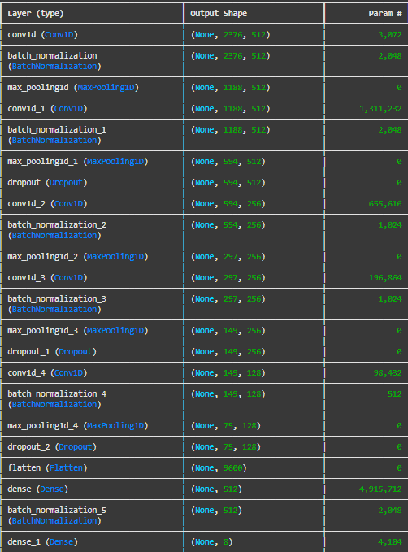
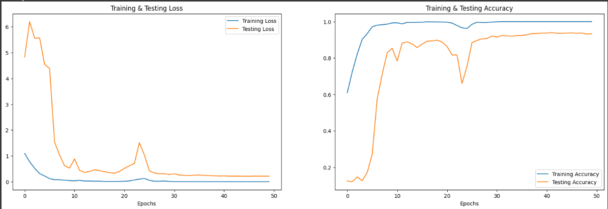
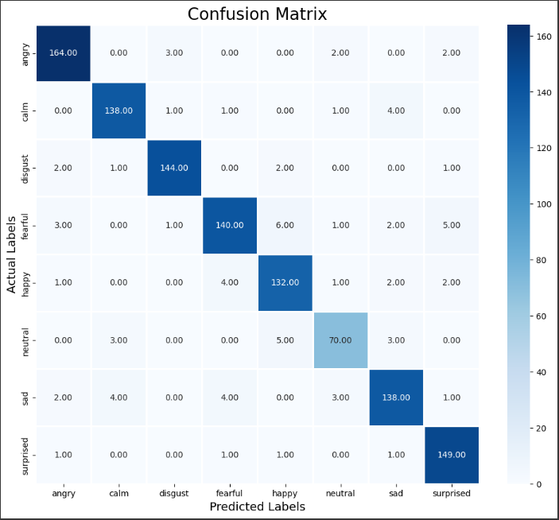

# Speech Emotion Recognition (SER) using CNN

---

This folder contains the implementation of a Speech Emotion Recognition (SER) model using a Convolutional Neural Network (CNN) architecture.

--- 

## Installation and Execution Guide

1. **Clone or Download** this repository
2. **Mount Google Drive**
    ```
    from google.colab import drive
    drive.mount('/content/drive')
    ```
3. **Install *tensorflow* Library**
    ```
    !pip install tensorflow
    ```
4. **Import** the required libraries 
5. **Load the Dataset**
    ```
    ravdess = "/content/drive/MyDrive/ML Team 35/Codes/SER/datasets/RAVDESS/"
    ```
    Make sure the **folder path** of the dataset is correct, and that the **root folder** (in this case *ML Team 35*) must be located in the main page of *MyDrive* in your google drive
6. **Run the following cell** according to the Program Flow below

---

## Program Flow
1. [Importing Libraries and Data](#importing-libraries-and-data)
2. [Preprocessing Datasets](#preprocessing-datasets)
3. [Data Augmentation](#data-augmentation)
   - [Noise Addition](#noise-addition)
   - [Time Stretching](#time-stretching)
   - [Time Shifting](#time-shifting)
   - [Pitch Shifting](#pitch-shifting)
4. [Feature Extraction](#feature-extraction)
   1. [Extracted Features](#extracted-feature)
      - [Zero Crossing Rate (ZCR)](#zero-crossing-rate-zcr)
      - [Root Mean Square Energy (RMSE)](#root-mean-square-energy-rmse)
      - [Mel-Frequency Cepstral Coefficients (MFCCs)](#mel-frequency-cepstral-coefficients-mfccs)
   2. [Feature Combination](#feature-combination)
   3. [Data Augmentation with Feature Extraction](#data-augmentation-with-feature-extraction)
   4. [Final Dataset Creation](#final-dataset-creation)
5. [Data Preparation](#data-preparation)
6. [Model Construction](#model-construction)
7. [Training and Validation](#training-and-validation)
8. [Model Evaluation](#model-evaluation)
9. [Save Model, Parameters, Scaler, and Encoder](#save-model-parameters-scaler-and-encoder)
10. [Real-Life Model Testing](#real-life-model-testing)

---

## Importing Libraries and Data

First things first, we need to import all of the libraries required to execute this program. 

### General-Purpose Libraries:
    pandas, numpy, os, sys, matplotlib

### Extracting Data from Audio Files:
    librosa, seaborn

### Data Preprocessing and Evaluation:
    sklearn

### Play the Audio Files:
    IPython.display, tqdm

### Deep Learning:
    tensorflow.keras

---

## Preprocessing Datasets

Data preprocessing prepares the raw audio data for the model to classify emotions based on the speech patterns. The preprocessing datasets process is done by first iterating through directories to extract filenames and their associated emotion labels. Based on this extracted filenames and labels, we will create a labeled dataset that maps each audio file to its corresponding emotion with the help of the pandas library.
```
ravdess_df['Emotions'] = ravdess_df['Emotions'].replace({
    1: 'neutral', 2: 'calm', 3: 'happy', 4: 'sad',
    5: 'angry', 6: 'fearful', 7: 'disgust', 8: 'surprised'
})
```
Next, it is better to visualize the data to analyze the dataset balance and distribution of emotion categories. 
Then, we will load the audio into numerical arrays (data) and stores the sampling rate (sr).
```
data, sr = librosa.load(file_path[0])
```
Sampling rate (sr) is the number of audio samples per second (commonly 22050Hz by default), while data is a 1D array which represents the amplitude of the waveform. This step is done to verify audio properties such as duration and quality before performing feature extraction. 
The next step is computing **Mel-Spectogram**, which is a time-frequency representation optimized for human perception, where we will converts power values to log scale (decibels) for easier analysis of sound intensity and captures patterns relevant to human speech or emotion recognition.
```
spectrogram = librosa.feature.melspectrogram(y=data, sr=sr, n_mels=128, fmax=8000)
log_spectrogram = librosa.power_to_db(spectrogram)
```
The last step is to compute **MFCCs**, which are widely used features for speech and audio processing. 
```
mfcc = librosa.feature.mfcc(y=data, sr=sr, n_mfcc=30)
```
The purpose of this step is to model the spectral shape of the audio, capture how sound varies with frequency, and to reduce data dimensionality while still preserving information relevant to perception.  

---

## Data Augmentation

Data Augmentation is crucial to make the model more robust and generalizable during training. We will perform some data augmentation techniques to simulate real-world variations in the audio data.

### Noise Addition

```
def noise(data):
    noise_amp = 0.035*np.random.uniform()*np.amax(data) 
    data = data + noise_amp*np.random.normal(size=data.shape[0]) 
    return data
```
This function adds random Gaussian noise to the audio signal to simulate background interference, such as crowd noise or static.

### Time Stretching 

```
def stretch(data, rate=0.8):
    return librosa.effects.time_stretch(data, rate=rate)
```
This function changes the speed (tempo) of the audio while keeping the pitch constant to train the model to recognize speech patterns from both fast and slow speakers. 

### Time Shifting

```
def shift(data):
    shift_range = int(np.random.uniform(low=-5, high = 5)*1000) 
    return np.roll(data, shift_range)
```
This function shifts the audio data forward or backward in time by a random duration (in this case up to ±5 seconds) to train the model to spot keywords even if spoken at different points in time.

### Pitch Shifting

```
def pitch(data, sampling_rate, pitch_factor=0.7):
    return librosa.effects.pitch_shift(data, sr=sampling_rate, n_steps=pitch_factor)
```
This function adjusts the pitch of the audio signal while keeping the tempo constant to train the model to handle variations in voice tones and accents.

---

## Feature Extraction

This step is done to capture key characteristics of audio signal that are useful for training the model to classify emotions. 

### Extracted Feature

#### Zero Crossing Rate (ZCR)

```
def zcr(data, frame_length, hop_length):
    zcr = librosa.feature.zero_crossing_rate(data, frame_length=frame_length, hop_length=hop_length)
    return np.squeeze(zcr)
```
This function counts the number of times the audio signal crosses the zero amplitude axis in each frame which is used to measure frequency characteristics. High ZCR represents sharp sounds or high-pitched noises, such as whistles and screams, while Low ZCR represents smooth sounds or low-frequency signals, such as human speech. In emotion recognition, this is used to distinguish voiced (low ZCR) and unvoiced (high ZCR) sounds. 

#### Root Mean Square Energy (RMSE)

```
def rmse(data, frame_length=2048, hop_length=512):
    rmse = librosa.feature.rms(y=data, frame_length=frame_length, hop_length=hop_length)
    return np.squeeze(rmse)
```
This function computes the energy (loudness) of the signal over short time frames to measure amplitude variations, useful for detecting loud or quiet parts. High RMSE corresponds to intense emotions like anger, while low RMSE reflects calmness or sadness.

#### Mel-Frequency Cepstral Coefficients (MFCCs)

```
def mfcc(data, sr, frame_length=2048, hop_length=512, flatten: bool = True):
    mfcc = librosa.feature.mfcc(y=data, sr=sr)
    return np.squeeze(mfcc.T) if not flatten else np.ravel(mfcc.T)
```
This function extracts features representing the spectral envelope (frequency distribution) of the audio signal, and is essential for speech emotion recognition as it identifies vocal tones and patterns.

### Feature Combination 

This step combines ZCR, RMSE, and MFCCs into a single feature vector, where each vector represents the entire audio clip in terms of frequency, loudness, and timbre. This step ensures that the model has a comprehensive view of the audio signal by combining multiple features and increases the model performance.

### Data Augmentation with Feature Extraction

This step generates augmented versions of each audio clip and extracts features from them by extracting features from the original audio, noisy audio to simulate background noise, and pitch-shifted audio to handle pitch variations. This step is done to create multiple variants of each audio clip to improve the model's ability to generalize and make it more robust, as well as handling real-world variability like background noise and pitch differences.

### Final Dataset Creation

Loop through all audio files to extract features, augment features, and assign emotion labels to each extracted feature vector. Finally, with the help of the pandas library, we save this feature and their corresponding labels into a CSV file for later use in training and model evaluation.

---

## Data Preparation

This step prepares the data for the Speech Emotion Recognition model to process:

  - **Splitting Features and Labels**: splits the dataset into features (X) and labels (Y)
  - **One-Hot Encoding for Labels**: converts categorical labels (emotions) into binary vectors using one-hot encoding
  - **Train-Test Split**: splits the dataset into training and testing set while randomizing data to avoid bias and ensures reproducibility
  - **Reshaping Data**: reshapes the data to the corresponding dimension required by the model
  - **Feature Scaling**: Standardizes the data by scaling features to have mean 0 and standard deviation 1
  - **Load Helper Functions**: Load *ModelCheckpoint* to saves the best model weights during training based on validaiton accuracy, *EarlyStopping* to stops training early if the validation accuracy doesn't improve for consecutive epochs, and *ReduceLROnPLateau* to dynamically reduce the learning rate if the validation accuracy stop improving for consecutive epochs

---

## Model Construction

Next, we will construct our CNN model by combining various combinations of convolution layer, pooling layer, normalization layer, dropout layer, flatten layer, and dense layer. The final architecture of our model is as follows:



---

## Training and Validation

```
history=model.fit(x_traincnn, y_train, epochs=50, validation_data=(x_testcnn, y_test), batch_size=64,callbacks=[early_stop,lr_reduction,model_checkpoint])
```
We begin training as well as perform validation on the model with the prepared dataset, and we can also visualize the loss and accuracy to gives us a better idea of the model's performance



---

## Model Evaluation

After completing the training process, we will test the model's performance on the testing dataset and we will use confusion matrix to provide deatiled insights into the model's overall performance across different classes. Confusion Matrix shows misclassifications and helps identify which classes are causing problems and derives metrics like accuracy, precision, recall, and F1-score. However, the main advantage of Confusion Matrix is that it handles performance evaluation for multi-class classification tasks. 



---

## Save Model, Parameters, Scaler, and Encoder

After performing training and testing on the data, we need to save our model so that we can integrate it into our chatbot pipeline for the project. We save the model as a *json* file, and save the model weights as a *h5* file. Besides the model and parameters, with the help of the *pickle* library, we saves the *StandardScaler* and *OneHotEncoder* to ensure that the same scaling parameters and encoding scheme is applied during deployment. 

---

## Real-Life Model Testing

After completing all of the steps above, we can now deploy the SER model to test with our own recorded speech. We begin by importing and loading all of the necessary libraries, as well as models, parameters, scaler, and encoder. Next, we use the *IPython.display* library to record our voice and save it. Finally, we will perform the prediction by preprocessing our audio, by scaling, encoding and extracting its feature to give to our previously trained model, so that it can generate the emotion prediciton. 

---